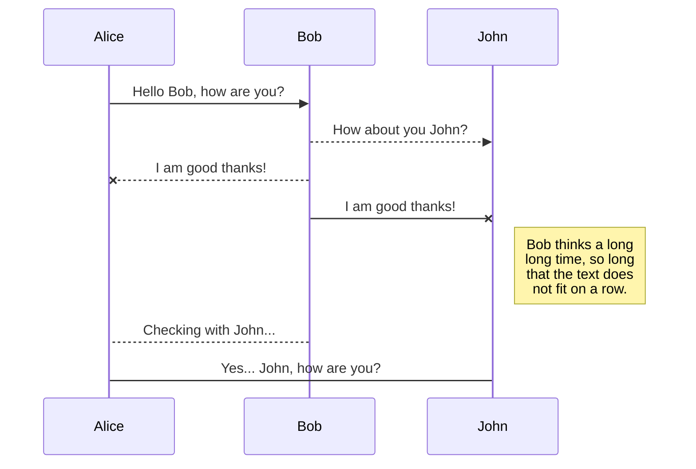
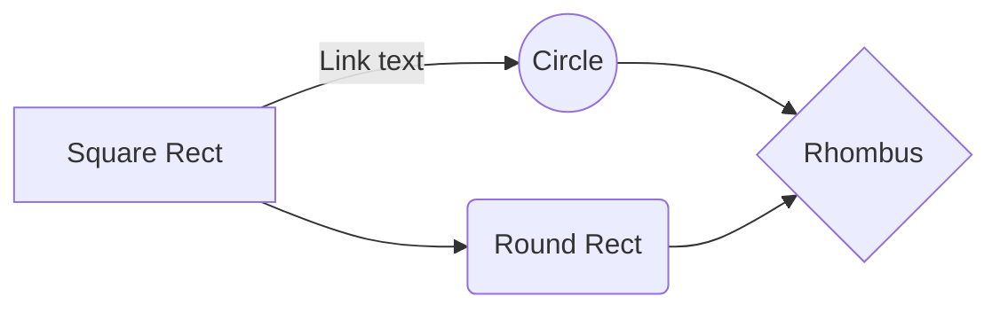

# Cours React

Résumé de la semaine

# Bases de Javascript

J'ai pu en dehors des cours retravailler les bases de Javascript ce qui me permettra de mieux maîtriser React

# Bases de React

Pour cette semaine nous avons retravaillé les bases de React qui me manquaient.

## Composants
Les composants permettent de structurer notre code en créant des composants individuels qui seront réutilisables.

## Hooks

Les hooks permettent de bénéficier d’un état local et d’autres fonctionnalités de React sans avoir à écrire une classe.

- useState permet d'avoir une variable et une fonction setter pour cette variable
- useEffect permet l’exécution d’effets de bord dans les fonctions composants 

Les hooks custom permettent d'organiser et d'optimiser nos composants custom en réduisant le nombre de lignes de code dans celui-ci et en permettant de réutiliser du code custom sans avoir a le réécrire.

## Promesses

Les promesses sont utilisées en conjonction avec des appels http et les mots clés .fetch() et .then().
Elles prennent en paramètre 2 fonctions, une qui gère la réussite de l'appel et l'autre son échec

## API

J'ai utilisé pour la première fois une api (interface de programmation). Une API est une interface avec des endpoints (points d'entrées) accessibles par différentes requêtes.

La plupart des apis suivent une convention de base pour les requêtes appelée CRUD (Create Read Update Delete) qui représentent les fonctions de bases que l'api doit pouvoir réaliser.

### Create

- Post: une requête post permet d'envoyer de la donnée à l'api pour qu'elle soit stockée dans l'api.
- 
### Read

Get : une requête get permet de récupérer de la donnée depuis l'api en fonction de la requête envoyée

### Update

Patch : permet de modifier une ressource stockée dans l'api
Put : permet de remplacer une ressource stockée dans l'api

### Delete

Delete : Suppression d’une ressource ou d’une collection.

# Packages utilisés

## npm react router dom
React router dom est un package utilisé permettant de gérer la navigation dans un site.
Il faut au préalable créer et définir les routes et ensuite mettre le code gérant le changement de page.

## react-bootstrap

Bootstrap est un outil très connu pour faciliter le développement front-end. Il propose une bibliothèque de composants préfabriqués comme des boutons, des champs input des tables etc avec des classes CSS toutes prêtes.
 
 # Site de déploiement
J'ai utilisé le site 

## KaTeX

You can render LaTeX mathematical expressions using [KaTeX](https://khan.github.io/KaTeX/):

The *Gamma function* satisfying $\Gamma(n) = (n-1)!\quad\forall n\in\mathbb N$ is via the Euler integral

$$
\Gamma(z) = \int_0^\infty t^{z-1}e^{-t}dt\,.
$$

> You can find more information about **LaTeX** mathematical expressions [here](http://meta.math.stackexchange.com/questions/5020/mathjax-basic-tutorial-and-quick-reference).

## UML diagrams

You can render UML diagrams using [Mermaid](https://mermaidjs.github.io/). For example, this will produce a sequence diagram:

And this will produce a flow chart:

